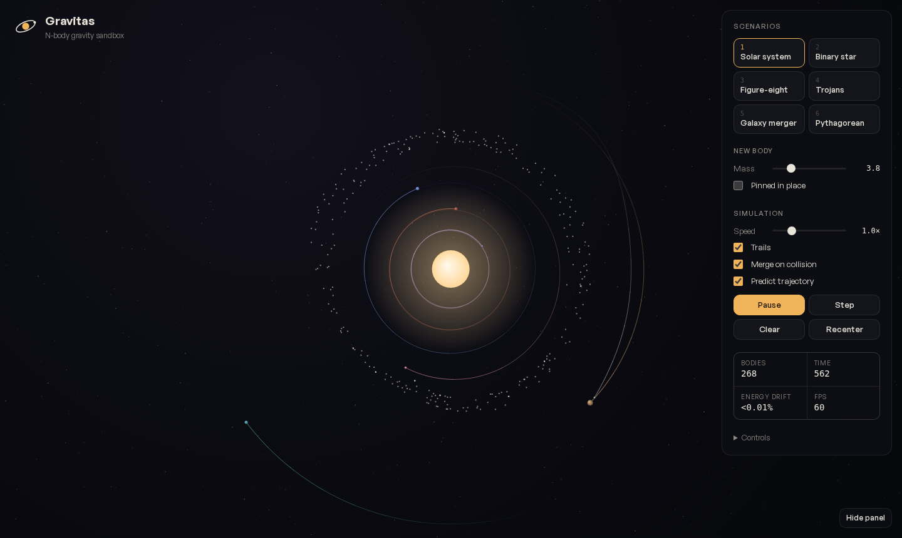
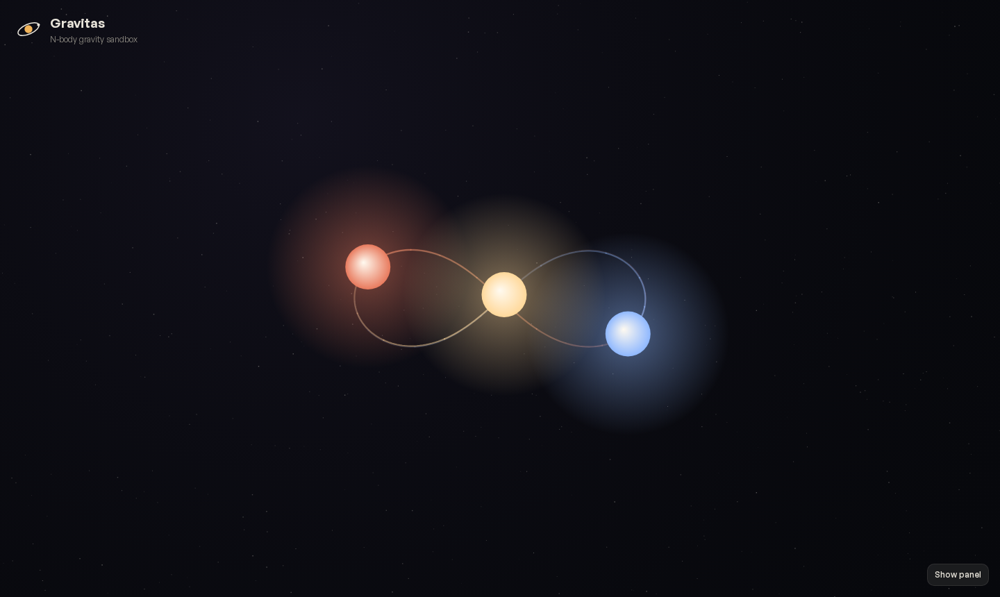
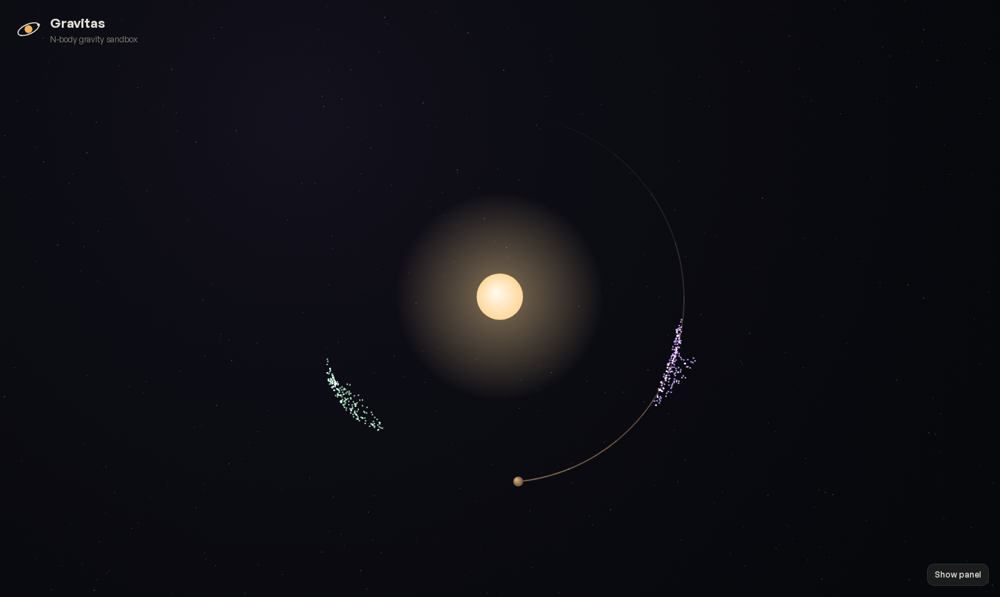
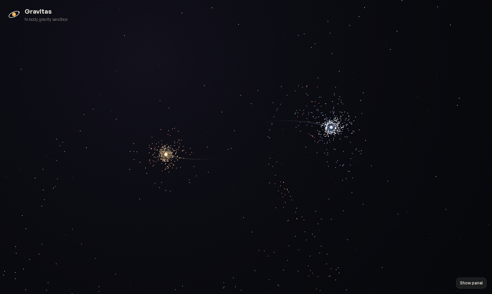

# Gravitas

**Fling planets, collide galaxies and watch the three-body problem dance — right in your browser.**

Gravitas is a zero-dependency N-body gravity sandbox written in plain JavaScript and Canvas 2D. No build step, no frameworks: open `index.html` and start throwing worlds around.

**▶ Live demo:** https://iadithyan479-wq.github.io/Gravitas/



## Features

- **Slingshot launching** — click and drag to throw a body; pull back further for more speed.
- **Live trajectory prediction** — a dotted ghost path shows where your body will go *before* you let go, simulated against every moving body in the scene.
- **Tap to orbit** — a single click drops a body onto a perfect circular orbit around whatever is pulling on it hardest.
- **Collisions that merge** — bodies combine while conserving mass and momentum.
- **Energy-drift readout** — watch how well the integrator conserves total energy (usually < 0.01%).
- **Pan, zoom, pinch** — works with mouse, trackpad and touch.
- **Deep links** — share a scenario with `#solar`, `#binary`, `#eight`, `#trojans`, `#galaxies` or `#pythagorean`.

## Scenarios

| # | Scenario | What you are looking at |
|---|----------|-------------------------|
| 1 | **Solar system** | A star, six planets, a moon and an asteroid belt placed outside the giant planet's chaotic zone. |
| 2 | **Binary star** | Two suns orbiting each other with a circumbinary planet (think Kepler-16b) and a debris ring. |
| 3 | **Figure-eight** | Chenciner & Montgomery's (2000) periodic solution: three equal masses chasing each other along one figure-eight. |
| 4 | **Trojans** | Asteroids librating around Jupiter's L4/L5 Lagrange points, set up in the barycentric rotating frame so they really stay put. |
| 5 | **Galaxy merger** | Two disk galaxies (~2,000 test stars) on a bound, off-axis pass, throwing off tidal tails à la Toomre & Toomre (1972). |
| 6 | **Pythagorean** | Burrau's 1913 problem — masses 3, 4, 5 released at rest on a 3-4-5 triangle. Chaotic until one body is ejected. |

| Figure-eight | Trojans | Galaxy merger |
|---|---|---|
|  |  |  |

## Controls

| Input | Action |
|-------|--------|
| Drag | Launch a body (slingshot) |
| Click / tap | Drop a body into a circular orbit |
| Right-drag or Shift + drag | Pan |
| Wheel / pinch | Zoom around the cursor |
| `Space` | Pause / play |
| `S` | Step one frame |
| `C` | Clear everything |
| `T` | Toggle trails |
| `F` | Recenter and fit |
| `1`–`6` | Load a scenario |

## How it works

```
src/
├── physics.js    # World, Body, integrator, collisions, prediction
├── scenarios.js  # Initial conditions for each preset
├── main.js       # Camera, input, rendering, UI
└── style.css
```

- **Integrator:** velocity Verlet (kick-drift-kick). It is *symplectic*, so orbits stay closed over thousands of revolutions instead of spiralling in or out like they would with naive Euler integration.
- **Gravity:** direct O(n²) summation between massive bodies with Plummer softening (ε = 4) so close encounters stay finite.
- **Test particles:** asteroids and galaxy stars are *massless* — they feel gravity but don't exert it. That makes the cost O(n·m) instead of O(n²), which is how the galaxy merger runs thousands of stars at 60 fps.
- **Adaptive sub-stepping:** each frame is split into sub-steps no larger than `dt = 0.05`, so raising the speed slider trades CPU for time rather than accuracy.
- **Units:** G = 1, distance in world pixels. Circular orbital speed is simply `v = √(M / r)`.

Open the dev-tools console and poke at `window.gravitas.world` to experiment.

## Run locally

It is a static site — any file server works:

```bash
git clone https://github.com/iadithyan479-wq/Gravitas.git
cd Gravitas
python3 -m http.server 8000   # then open http://localhost:8000
```

(ES modules need to be served over HTTP, so double-clicking `index.html` won't work in most browsers.)

## Ideas for next steps

- Barnes–Hut quadtree to make *every* body massive at large N
- WebGL renderer for 100k+ particles
- Record & share a simulation as a URL
- Relativistic precession toggle (Mercury's perihelion)

## License

[MIT](LICENSE)
